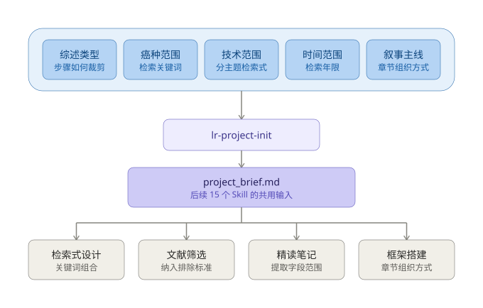

# 文献综述 AI Agent Pipeline

> 一套可复用的学术文献综述自动化流水线 —— 把综述写作从「选题」到「投稿返修」拆成 6 个阶段、16 个可独立调用的 Skill。

[](LICENSE)
[](https://www.python.org/)
[](#技能清单)

---

## 这是什么

写一篇学术综述，最难的不是「写」，而是**流程**：文献检索怎么做才不漏、筛选标准怎么定才可复现、引用怎么保证不是编的、图表怎么达到投稿要求。

这个项目把一篇综述的完整生命周期拆解成 **16 个独立的 Skill**，每个 Skill：

- 有**明确的输入文件和输出文件**（Markdown / CSV / JSON），步骤之间靠文件传递，而不是靠对话记忆
- 有**质量检查清单**，不达标不放行
- 关键环节配有**可独立运行的 Python 脚本**（10 个），不依赖 AI 也能执行确定性操作

覆盖 **中文核心期刊** 和 **SCI 英文期刊** 双轨。

---

## Pipeline 如何运转

16 个 Skill 是一套通用的流程引擎，对任何选题都一视同仁；但引擎需要 **5 个项目参数**才能启动。第一个 Skill `lr-project-init` 负责收集参数，产出 `project_brief.md` —— 这份文件是后续 15 个 Skill 的共用输入。



| 参数 | 谁读它 | 具体改变什么 |
|------|--------|-------------|
| 癌种范围 | `lr-search-strategy` | 检索式中的癌种关键词组 |
| 技术范围 | `lr-search-strategy` | 分主题检索式的条数（每种技术各配一组） |
| 时间范围 | `lr-pubmed-search` | 检索年限过滤器，决定文献库规模 |
| 叙事主线 | `lr-framework` | 章节排序逻辑（技术分类 / 临床场景） |
| 综述类型 | `lr-pipeline` | 步骤裁剪（叙述性综述跳过质量评估与 GRADE） |

这 5 项在检索前必须全部拍板。检索式一旦定稿，文献库即成既成事实 —— 事后修改要重跑检索、筛选、精读三个阶段的工作。

---

## 核心特性

| 特性 | 说明 |
|------|------|
| **6 阶段 16 技能** | 选题协议 → 证据库构建 → 框架搭建 → 分章写作 → 期刊适配 → 投稿返修 |
| **双轨输出** | `zh_CN` 中文核心（GB/T 7714-2015 引用格式，中英文对照摘要）／ `en_US` SCI 英文（Vancouver 格式） |
| **防幻觉门禁** | 初稿必须通过 7 层引用验证（PubMed API / Crossref DOI / 证据库比对 / 数据点溯源）才能进入润色 |
| **全文级精读** | 三阶段流水线（OA PDF 下载 → 正文提取 → 笔记增强），把摘要级笔记升级为全文级笔记 |
| **Zotero 自动同步** | 通过 Zotero Web API 批量导入文献，无需手动拖拽 RIS 文件 |
| **出版级图表** | 色盲友好配色、期刊尺寸模板、≥1200 DPI 矢量输出 |
| **可回溯** | 任何阶段发现问题都能回退到上游最小修复范围，记录在 `backtrack_log` |

---

## 快速开始

### 1. 安装

```bash
git clone https://github.com/<your-name>/literature-review-agent.git
cd literature-review-agent
```

**安装到 WorkBuddy（或兼容的 Agent 环境）：**

```bash
# macOS / Linux
bash install.sh

# Windows PowerShell
powershell -ExecutionPolicy Bypass -File install.ps1
```

安装脚本会把 `skills/lr-*` 复制到 `~/.workbuddy/skills/`。

**安装 Python 依赖：**

```bash
pip install -r requirements.txt
```

### 2. 使用

在 Agent 对话中直接说：

```
开始写综述：单细胞测序在肿瘤免疫微环境中的应用
```

总控调度器 `lr-pipeline` 会自动接管，引导你完成参数确认 → 检索 → 筛选 → 精读 → 框架 → 写作 → 验证 → 投稿。

**也可以直接调用单个 Skill：**

```
设计检索式          → lr-search-strategy
精读文献            → lr-reading-notes
验证引用（防幻觉）  → lr-citation-verify
生成图表            → lr-figure-maker
```

### 3. 无需 AI 也能跑脚本

10 个 Python 脚本都是标准库 + 常见三方库，可以脱离 Agent 独立运行：

```bash
# 多数据库检索式生成
python skills/lr-search-strategy/scripts/build_strategy.py --help

# 文献快速筛选
python skills/lr-literature-screen/scripts/filter_quick.py --help

# 引用验证（7 层验证中的 5 层自动化）
python skills/lr-citation-verify/scripts/verify_citations.py --help

# OA PDF 批量下载
python skills/lr-zotero-import/scripts/download_oa_pdfs.py --help

# PDF 正文提取（IMRaD 结构化）
python skills/lr-zotero-import/scripts/pdf_reader.py --help

# Zotero Web API 批量导入（API Key 交互输入，不留 shell 历史）
python skills/lr-zotero-import/scripts/zotero_web_import.py screened.csv \
    --collection-name "My Review"
```

---

## 技能清单

### 阶段 1：选题协议

| Skill | 功能 | 产出 |
|-------|------|------|
| `lr-project-init` | 确认综述类型、目标语言、PICO/PICOS/PEO 框架、纳入排除标准 | `project_brief.md` + `project_status.json` |
| `lr-benchmark` | 学习 3-5 篇高水平同类综述的框架/语言/图表策略 | `benchmark_report.md` |

### 阶段 2：证据库构建

| Skill | 功能 | 产出 | 脚本 |
|-------|------|------|------|
| `lr-search-strategy` | 按 PICO 设计 PubMed / WoS / Scopus / CNKI 检索式 | `search_strategy.md` | `build_strategy.py` |
| `lr-pubmed-search` | 执行检索、跨库去重、自动标注优先级和章节 | `literature_db.csv` | `fetch_pubmed.py` |
| `lr-literature-screen` | 两轮筛选，收敛到 50-80 篇精读清单 | `screened_literature.csv` | `filter_quick.py` |
| `lr-zotero-import` | 导入 Zotero、创建集合、获取 PDF、校验题录 | `.ris` / 报告 | `generate_ris.py` `download_oa_pdfs.py` `pdf_reader.py` `zotero_web_import.py` |
| `lr-reading-notes` | 结构化精读笔记（v3 支持全文级精读） | `reading_notes/` | `batch_enrich.py` |

### 阶段 3：框架搭建

| Skill | 功能 | 产出 |
|-------|------|------|
| `lr-framework` | 提炼论点树、设计章间逻辑链、识别矛盾论点、规划图表 | `framework.md` |

### 阶段 4：分章写作

| Skill | 功能 | 产出 | 脚本 |
|-------|------|------|------|
| `lr-chapter-writing` | 按论点树逐章撰写初稿（中英双语） | `manuscript/full_draft.md` | — |
| `lr-citation-verify` | **防幻觉门禁**：7 层引用验证 | `citation_verification_report.md` | `verify_citations.py` |

### 阶段 5：期刊适配

| Skill | 功能 | 产出 | 脚本 |
|-------|------|------|------|
| `lr-figure-maker` | 生成期刊规范的示意图、数据图、汇总表 | `figures/` | `generate_figure.py` |
| `lr-journal-select` | 匹配 3-5 个目标期刊（IF / 分区 / 审稿周期 / APC） | `journal_match.md` | — |
| `lr-polish` | 语言流畅性、术语一致性、学术规范性润色 | `polished/polished_draft.md` | — |
| `lr-cover-letter` | 生成 Cover Letter / 投稿信 | `cover_letter.md` | — |

### 阶段 6：投稿返修

| Skill | 功能 | 产出 |
|-------|------|------|
| `lr-reviewer-response` | 模拟审稿意见、逐条回复、拒稿改投预案 | `reviewer_comments.md` + `rebuttal_letter.md` |

### 总控

| Skill | 功能 |
|-------|------|
| `lr-pipeline` | 调度器：扫描项目目录判断进度、按语言路由、调度下一步、管理回溯 |

---

## 双轨路由

Pipeline 通过 `project_status.json` 的 `language` 字段自动适配：

| 参数 | `zh_CN` 中文核心 | `en_US` SCI 英文 |
|------|------------------|------------------|
| 对标库学习 | 可选 | **强制** |
| 期刊选择 | 可选 | **强制** |
| 投稿信 | 可选 | **强制** |
| 引用格式 | GB/T 7714-2015 | Vancouver / APA |
| 摘要要求 | **中英文对照结构式摘要** | Structured Abstract (200-300 words) |
| 数据库优先级 | PubMed + CNKI | PubMed + WoS + Scopus |
| 字数 | 8000-12000 字 | 4000-8000 words |

---

## 文件流转

```
project_brief.md ──► search_strategy.md ──► literature_db.csv
                                                  │
                                                  ▼
                                        screened_literature.csv
                                                  │
                                                  ▼
                                          reading_notes/*.md
                                                  │
                                                  ▼
                                            framework.md
                                                  │
                                                  ▼
                                    manuscript/full_draft.md
                                                  │
                                        ┌─────────┴─────────┐
                                        ▼                   ▼
                              citation_verification    figures/
                                  _report.md
                                        │
                                        ▼
                                polished_draft.md
                                        │
                                        ▼
                                 submission_ready
```

---

## 质量底线

1. **引用可验证** — 每条引用必须能在 PubMed / Google 检索到
2. **证据可追溯** — 每条论断可回到具体文献和精读笔记
3. **缺失标记** — 不确定内容标注「需人工核查」
4. **推测区分** — 推测性内容不写成事实
5. **AI 边界** — AI 辅助写作，不代替作者承担学术责任
6. **防幻觉门禁** — 未通过引用验证不得进入润色
7. **语言适配** — 中文综述术语首见标注英文；英文综述用 SCI 地道表达

---

## 依赖

```
requests      # HTTP 请求（PubMed / CrossRef / Unpaywall / Zotero API）
pymupdf       # PDF 正文提取
pandas        # 文献库表格处理
matplotlib    # 图表绘制
SciencePlots  # 期刊级图表样式（一行切换 Nature/Cell）
great_tables  # 出版级学术表格
schemdraw     # 程序化机制示意图
```

详见 `requirements.txt`。

---

## 项目结构

```
literature-review-agent/
├── README.md
├── LICENSE
├── requirements.txt
├── install.sh / install.ps1
├── docs/
│   └── pipeline_guide.md            # 完整流程说明
└── skills/
    ├── lr-pipeline/SKILL.md          # 总控调度器
    ├── lr-project-init/SKILL.md
    ├── lr-benchmark/SKILL.md
    ├── lr-search-strategy/
    │   ├── SKILL.md
    │   └── scripts/build_strategy.py
    ├── lr-pubmed-search/
    │   ├── SKILL.md
    │   └── scripts/fetch_pubmed.py
    ├── lr-literature-screen/
    │   ├── SKILL.md
    │   └── scripts/filter_quick.py
    ├── lr-zotero-import/
    │   ├── SKILL.md
    │   └── scripts/
    │       ├── generate_ris.py
    │       ├── download_oa_pdfs.py
    │       ├── pdf_reader.py
    │       └── zotero_web_import.py
    ├── lr-reading-notes/
    │   ├── SKILL.md
    │   └── scripts/batch_enrich.py
    ├── lr-framework/SKILL.md
    ├── lr-chapter-writing/SKILL.md
    ├── lr-citation-verify/
    │   ├── SKILL.md
    │   └── scripts/verify_citations.py
    ├── lr-figure-maker/
    │   ├── SKILL.md
    │   └── scripts/generate_figure.py
    ├── lr-journal-select/SKILL.md
    ├── lr-polish/SKILL.md
    ├── lr-cover-letter/SKILL.md
    └── lr-reviewer-response/SKILL.md
```

---

## 移植到其他 Agent 平台

**Python 脚本**：完全可移植，标准 Python，不依赖任何平台 API，直接命令行运行。

**SKILL.md**：本质是「结构化 prompt 模板 + 领域知识」，内容（检查清单、验证流程、字段映射表）对任何 AI Agent 都有价值，但不同平台的 Skill 加载机制不同，需要按目标平台格式改写 frontmatter。可迁移的核心资产：

1. `scripts/` 下 10 个 Python 脚本
2. 6 阶段 16 步骤的流程设计（可写成单个总 prompt）
3. 各 Skill 的质量检查清单和字段映射表
4. 关键 prompt 模板（PICO 框架、检索式设计、精读笔记结构）

---

## 已知限制

- 本 Pipeline 是**辅助工具**，产出需经作者审核后方可投稿
- 引用验证虽有 7 层，但仍建议人工抽查关键文献
- Web of Science / Scopus / CNKI 无公开 API，需人工导出后导入
- 中文核心期刊投稿仍需按各刊最新《稿约》调整格式

---

## License

[MIT](LICENSE)
